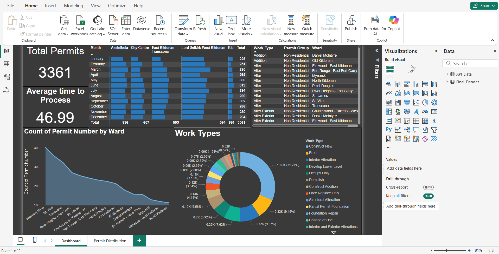
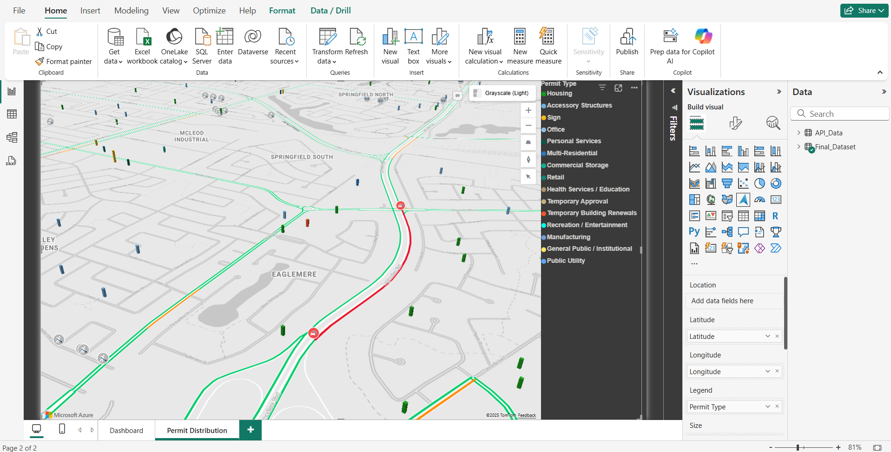

# 🏗️ Winnipeg Building Permits Dashboard (Power BI)

Turn City-of-Winnipeg permit records into actionable spatial insights—with automated data prep, live KPI cards, and an **Azure Maps 3-D layer that displays real-time traffic conditions.**

---

## 🎯 Objectives
- **Monitor** permit volume & processing speed in near-real time.  
- **Visualize** geographic distribution of work types across wards for inspection & planning.  
- **Automate** daily ETL so analysts spend minutes (not hours) maintaining the report.

---

## 🗂️ Key Features
| Category | Details |
|----------|---------|
| **KPI Cards** | Total permits (3 361), avg. processing time (≈ 47 days). |
| **Area Chart** | Permit count by ward with dynamic benchmarking line. |
| **Donut Chart** | Work-type split with drill-through to record table. |
| **3-D Azure Maps** | Height-encoded permit pins **+ live-traffic overlay (flow lines, jams, incidents)**. |
| **Row-Level Filters** | Slice by date range, ward, permit group, work type. |
| **Automated Refresh** | Power Query pulls Socrata API daily; M code cleans malformed geolocation & date fields. |

---

### ⚠️ Azure Maps Live-Traffic Prerequisites
1. Power BI Desktop **February 2024**.  
2. Enable preview: `File → Options & settings → Preview features → Azure Maps visual`.  
3. Your Power BI tenant must allow Azure Maps.

If these settings are disabled, the live-traffic layer will not render. Two screenshots are embedded below so you can still preview the intended experience.

---

## 📷 Screenshots
| Overview | Live-Traffic View |
|----------|------------------|
|  |  |

---

## 📑 Dataset
- **Source:** [City of Winnipeg – Building Permits (Socrata API)](https://ppdportal.winnipeg.ca/Permits/PropertyPermitSearch/SearchFAQ.jsp)  
- **Size:** 149 000 rows • 32 columns • 2012-present  
- **Cleaning highlights:** fixed ~2 000 mis-geocoded rows, standardized timestamp formats, removed null lat/long.

---

## 🛠️ Tech Stack
- **Power BI Desktop 2024.2** — visuals, DAX, Azure Maps.  
- **Power Query / M** — ETL & data-quality rules.  
- **Socrata REST API** — paginated JSON feed.  
- **DAX** — KPI & time-intelligence measures.  
- **Azure Maps** — 3-D layer with live traffic (TomTom).

---

## 🔄 Data-Prep Flow
```text
Socrata API  →  Power Query (M)  →  Data-quality fix  →  Model/DAX  →  Report
```
---

## 📫 Contact
For questions or feedback, open an issue or reach out:

- **Email:** [jaiminmp2003@gmail.com](mailto:jaiminmp2003@gmail.com)
- **LinkedIn:** [linkedin.com/in/dsjaiminpatel](https://www.linkedin.com/in/dsjaiminpatel)

